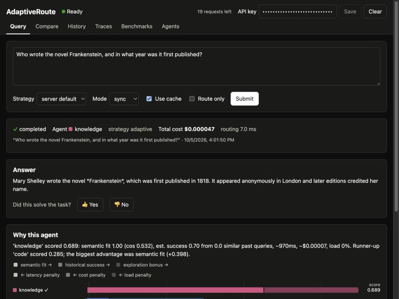
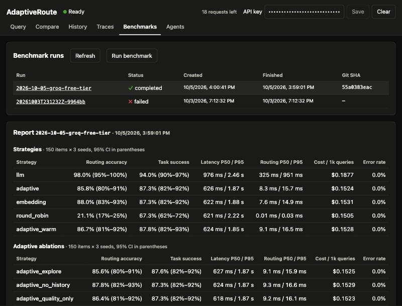
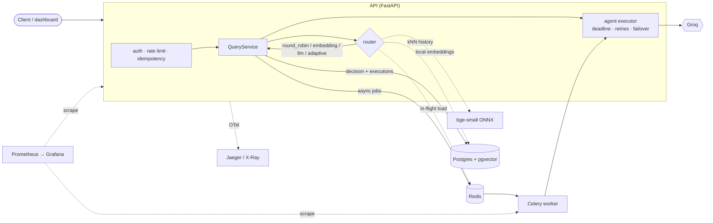

# AdaptiveRoute

**Adaptive multi-agent query routing, with a reproducible benchmark of four routing
strategies.**

AdaptiveRoute sends each user query to one of five specialised LLM agents: code, math,
SQL analytics, writing and general knowledge. The choice weighs:
- semantic relevance;
- historical task success on similar past queries;
- expected latency and cost;
- current load.

Every decision and outcome is stored, so the adaptive router learns from history. A
benchmark compares it against round-robin, embedding-similarity and LLM-as-router
baselines on the same recorded agent outputs, reporting accuracy, end-task success,
latency, throughput, errors and cost, each with confidence intervals.

Built with Python 3.12, FastAPI, PostgreSQL + pgvector, Redis, Celery, React, Docker,
OpenTelemetry, Prometheus/Grafana, Terraform (AWS ECS) and GitHub Actions. LLMs are
served by Groq (`openai/gpt-oss-20b`, `openai/gpt-oss-120b`); embeddings run locally
(bge-small, ONNX).

---

## Results

Benchmark run [`2026-10-05-groq-free-tier`](benchmarks/results/2026-10-05-groq-free-tier/report.md):
- 150 items × 5 agents, collected once from Groq (`gpt-oss-20b` / `gpt-oss-120b`);
- 900 real calls, 495K tokens, about $0.12 at list prices;
- each strategy replayed over 3 seeds, with 95% bootstrap CIs over items.

| Strategy | Routing accuracy | Task success | End-to-end latency P50 / P95 | Routing P50 | Cost / 1k queries |
|---|---|---|---|---|---|
| round_robin | 21.1% [17.3, 24.9] | 67.3% [61.8, 72.4] | 0.62 / 2.22 s | 0.0 ms | $0.151 |
| embedding | 88.0% [82.7, 93.3] | 87.3% [82.0, 92.0] | 0.62 / 1.88 s | 7.6 ms | $0.153 |
| **llm** | **98.0% [95.3, 100]** | **94.0% [90.0, 97.3]** | 0.98 / 2.46 s | 325 ms | $0.188 |
| adaptive (cold start) | 85.8% [80.0, 91.1] | 87.3% [82.0, 92.2] | 0.63 / 1.87 s | 8.3 ms | $0.152 |
| adaptive (warm, 5-fold) | 86.7% [80.9, 91.8] | 87.8% [82.2, 92.9] | 0.62 / 1.85 s | 9.1 ms | $0.153 |
| *oracle: cheapest agent that succeeds (reference)* | *34.0%* | *98.7%* | | | *$0.066* |

The error rate after failover was 0% for every strategy; 4 of the 750 agent calls
failed outright and failover recovered them.

**What it shows**

- **The LLM router wins on quality.** It gains +6.7 pp task success over embedding
  routing (paired 95% CI [+2.7, +10.7]). On the 26 deliberately ambiguous items it
  scores 100%, where embedding routing scores 50%. The price is +23% cost per query
  and ~40× routing latency, which is still small next to 0.6–1 s of execution.
- **My adaptive router did not beat plain embedding routing** (Δ task success −0.0 pp,
  CI [−0.7, +0.7]). There are two reasons:
  1. The embedding errors on ambiguous items are *confident*, with large similarity
     gaps, and by design the scoring weights only let history overturn near-ties.
  2. The dataset deliberately contains no near-duplicate queries, so kNN history is
     sparse. Giving the router history from 80% of the items (warm start), or
     increasing the success weight (ablation), changed nothing.
- **There is a lot of cost headroom.** The oracle reaches 98.7% success at 43% of the
  cost, mostly by using the cheap `writer` agent, which alone solves 80% of all items.
  An LLM router with a cost-aware cascade is the obvious next step
  ([future work](docs/limitations.md#future-work)).


**Service performance** (route-only load test, full Docker stack on a
MacBook Air M4, one API process, 16 concurrent clients;
[details](benchmarks/loadtest/README.md)):

| Strategy | Throughput, tracing off | P95, tracing off | Throughput, 100% traced | P95, 100% traced |
|---|---|---|---|---|
| round_robin | 796 req/s | 24 ms | 550 req/s | 39 ms |
| embedding | 806 req/s | 24 ms | 554 req/s | 44 ms |
| adaptive | 566 req/s | 37 ms | 387 req/s | 61 ms |

The adaptive router's two extra Postgres round trips cost about 30% of throughput
(a per-agent pgvector kNN, plus aggregates from a materialised view). Tracing every
request costs about another 30%, which is why production samples 10%.

---

## Dashboard

| Query: answer, router reasoning and per-term score breakdown | Benchmarks: the report above, with CIs and ablations |
|---|---|
|  |  |

## How it works



The **adaptive router** scores every agent and picks the highest:

```
score(a) = 0.45·semantic_fit(a) + 0.35·P̂(success | a, similar past queries)
         − 0.08·latency/budget − 0.07·cost/budget − 0.05·load (+ optional UCB bonus)
```

- `semantic_fit` is the query's similarity to the agent's profile, relative to the
  best-matching agent (temperature 0.05).
- `P̂` is a Beta-Binomial estimate over the agent's nearest labelled past queries
  (pgvector), shrunk towards the agent's overall rate.
- Latency and cost are estimated the same way.
- Saturated agents are skipped.

Each decision stores the per-term contributions, so the dashboard can show why an
agent won. With the default weights, history can only overturn *near-tie* semantic
decisions. That is a deliberate, tested property: near-ties are exactly where
embedding routing fails. Details: [system design](docs/system-design.md#31-adaptive-scoring-function).

## Engineering highlights

| Area | What's there |
|---|---|
| Reliability | per-call deadline; `Retry-After`-aware retries with full jitter; failover to the runner-up agent; LLM-router → embedding fallback; atomic `queued→running` claim so redelivered Celery tasks never double-spend; sweeper for lost or stuck work |
| API | API-key auth (HMAC-peppered, constant-time compare); per-key Redis token bucket (atomic Lua); Postgres-backed `Idempotency-Key`; RFC 9457 problem+json; keyset pagination; OpenAPI docs |
| Data | Alembic migrations (CI checks model/migration drift); denormalised outcome table for single-table pgvector kNN with an HNSW index; materialised view refreshed by Celery beat |
| Observability | structlog JSON with request and trace ids; OpenTelemetry spans for HTTP, routing, agent calls, SQL, Redis and Celery; 15 Prometheus metrics; generated Grafana dashboard (latency, routing decisions, agent performance, errors, throughput, cost) |
| Evaluation | 150 validated items with deterministic checkers (unit tests, SQL result sets, numeric answers, writing constraints); collect-once/replay-many protocol; bootstrap CIs and paired comparisons; ablations; oracle and single-agent reference points; full provenance |
| Delivery | multi-stage Docker image; Compose stack; CI (lint, types, tests with Postgres + Redis, dashboard, image build + e2e smoke test); Terraform for ECS Fargate, RDS and ElastiCache; OIDC deploy workflow with migrations as a one-off task |

**Tests:** 206 passing (184 test functions; unit + integration against real Postgres
and Redis), 91% line coverage, `mypy --strict` clean, plus 22 dashboard tests.

## Quickstart

```bash
cp -n .env.example .env           # -n: never overwrite an existing .env; then add GROQ_API_KEY=...
make up                           # build + start api, worker, beat, postgres, redis, jaeger, prometheus, grafana
make api-key                      # prints an admin API key once
open http://localhost:8000        # dashboard (paste the key) · /docs for Swagger
```

Port 8000 taken? Run `AR_API_PORT=8080 make up`. Without a Groq key, routing works
and agent execution returns a clear `failed` status.

| URL | What |
|---|---|
| http://localhost:8000 | Dashboard: query, compare strategies, history, traces, benchmarks, agents |
| http://localhost:8000/docs | OpenAPI / Swagger UI |
| http://localhost:3000 | Grafana: "AdaptiveRoute – overview" |
| http://localhost:16686 | Jaeger |
| http://localhost:9090 | Prometheus |

```bash
curl -s localhost:8000/v1/queries -H "Authorization: Bearer $KEY" -H "Content-Type: application/json" \
  -d '{"query": "Which three customers spent the most in 2024?", "strategy": "adaptive"}'
curl -s localhost:8000/v1/route/compare -H "Authorization: Bearer $KEY" -H "Content-Type: application/json" \
  -d '{"query": "What is the time complexity of quicksort on average?"}'
```

More in the [API guide](docs/api.md).

## Running the benchmark

```bash
uv sync --group eval
make validate-dataset                                   # schema, references, negative controls, leakage
uv run python -m adaptiveroute.cli bench collect        # ~900 Groq calls; resumable; stops cleanly on quota
uv run python -m adaptiveroute.cli bench run --seeds 0,1,2   # replay all strategies → benchmarks/results/<run>/
```

Replays are free and deterministic given the committed matrix. Every report records
the git SHA, the dataset and matrix hashes, agent fingerprints, the price date and
library versions. See [evaluation methodology](docs/evaluation.md).

## Repository layout

```
src/adaptiveroute/   application package (domain, ports, routing, agents, api, worker, db, evaluation, ...)
tests/               unit + integration tests (pytest)
frontend/            React + TypeScript dashboard (Vite)
config/              agents.yaml (models, prompts, prices) · routing.yaml (scoring weights)
data/eval/           evaluation dataset (150 items) + retail SQLite fixture
migrations/          Alembic migrations
benchmarks/          outcome matrix, benchmark reports, load-test results
deploy/              Prometheus, Grafana (dashboards as code), Terraform (AWS)
docs/                architecture, system design, database, API, evaluation, ADRs, deployment, limitations
scripts/             fixture generator, OpenAPI export, Grafana dashboard generator, load test
```

## Documentation

- [Architecture](docs/architecture.md): components, request flow, AWS deployment view
- [System design](docs/system-design.md): scoring function, consistency, failure modes, scaling, security
- [Database schema](docs/database.md): ER diagram, pgvector kNN query, indexes, materialised view
- [API guide](docs/api.md) and the [OpenAPI schema](docs/api/openapi.json)
- [Evaluation methodology](docs/evaluation.md): dataset, checkers, protocol, metrics, statistics
- [Observability](docs/observability.md): logs, traces, metrics, dashboards, alerts
- [Deployment](docs/deployment.md): local Compose and AWS (Terraform + CD)
- [AWS deployment verification](docs/deployment-verification.md): a real end-to-end deploy, its problems and fixes, and live checks
- [Architecture decision records](docs/adr/README.md): 9 ADRs
- [Limitations and future work](docs/limitations.md)

## Limitations (short version)

- A small, purpose-built dataset (150 items).
- One provider sample per (item, agent) cell.
- The adaptive router learns from clean checker labels rather than real user feedback.
- The code-check sandbox is not a security boundary.
- The AWS stack was deployed and verified end to end once, then torn down to save
  cost ([evidence](docs/deployment-verification.md)); it hasn't served sustained
  traffic.

Full list: [docs/limitations.md](docs/limitations.md).

## License

MIT
