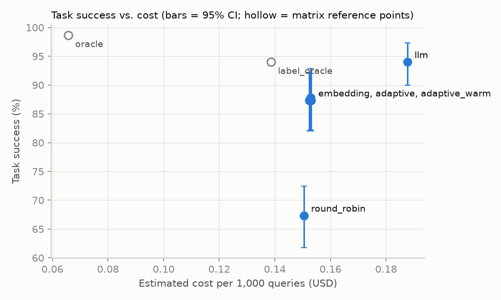
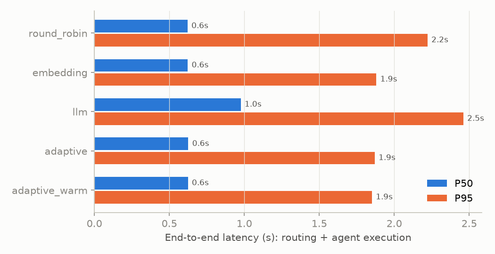
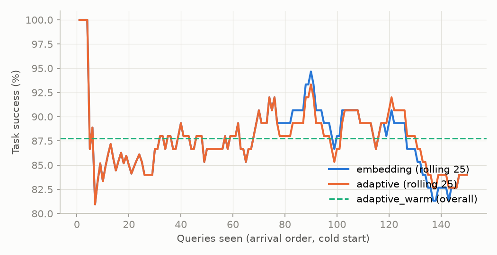

# AdaptiveRoute benchmark: `2026-10-05-groq-free-tier`

150 evaluation items x 5 agents, 3 seeds (0, 1, 2). Agent outcomes collected from **Groq (OpenAI-compatible API)** between 2026-10-03T23:02:35+00:00 and 2026-10-05T19:30:05+00:00; costs are estimates at list prices as of 2026-09-28.

## Headline results

| Strategy | Routing accuracy [95% CI] | Task success [95% CI] | Latency P50 / P95 (s) | Routing P50 / P95 (ms) | Cost / 1k queries | Error rate | Routing throughput (req/s, 1 worker) |
|---|---|---|---|---|---|---|---|
| **round_robin** | 21.1% [17.3, 24.9] | 67.3% [61.8, 72.4] | 0.62 / 2.22 | 0.0 / 0.0 | $0.1505 | 0.0% | 68,225 |
| **embedding** | 88.0% [82.7, 93.3] | 87.3% [82.0, 92.0] | 0.62 / 1.88 | 7.6 / 14.9 | $0.1531 | 0.0% | 123 |
| **llm** | 98.0% [95.3, 100.0] | 94.0% [90.0, 97.3] | 0.98 / 2.46 | 325.1 / 950.9 | $0.1877 | 0.0% | 2 |
| **adaptive** | 85.8% [80.0, 91.1] | 87.3% [82.0, 92.2] | 0.63 / 1.87 | 8.3 / 15.7 | $0.1524 | 0.0% | 112 |
| **adaptive_warm** | 86.7% [80.9, 91.8] | 87.8% [82.2, 92.9] | 0.62 / 1.85 | 9.1 / 16.5 | $0.1528 | 0.0% | 105 |

Latency = routing time (measured in-process; for the LLM router, its recorded API round trip) + agent execution time (measured against the provider during collection, including failover). Throughput is the sequential routing rate of a single worker (1 / mean routing time); see `docs/evaluation.md` for the live API load test.

### Difference vs. the embedding router (paired bootstrap, `*` = CI excludes 0)

| Strategy | Δ routing accuracy | Δ task success | Δ cost / 1k queries |
|---|---|---|---|
| round_robin | -66.9 pp [-73.6, -60.2] * | -20.0 pp [-27.8, -13.1] * | -0.0026 USD |
| llm | +10.0 pp [+4.0, +16.0] * | +6.7 pp [+2.7, +10.7] * | +0.0346 USD |
| adaptive | -2.2 pp [-4.5, -0.4] * | -0.0 pp [-0.7, +0.7] | -0.0007 USD |
| adaptive_warm | -1.3 pp [-3.1, +0.0] | +0.4 pp [+0.0, +1.3] | -0.0003 USD |







## Reference points (computed directly from the outcome matrix)

| Policy | Routing accuracy | Task success | Mean execution (s) | Cost / 1k queries | Error rate |
|---|---|---|---|---|---|
| always_code | 20.0% | 68.0% | 0.99 | $0.2251 | 0.0% |
| always_math | 20.0% | 66.0% | 1.74 | $0.2211 | 1.3% |
| always_sql | 20.0% | 48.0% | 1.69 | $0.1537 | 1.3% |
| always_writer | 20.0% | 80.0% | 0.98 | $0.0467 | 0.0% |
| always_knowledge | 20.0% | 72.0% | 0.67 | $0.1224 | 0.0% |
| label_oracle | 100.0% | 94.0% | 0.72 | $0.1386 | 0.7% |
| oracle | 34.0% | 98.7% | 1.04 | $0.0657 | 0.0% |

`label_oracle` always picks the labelled agent (perfect routing accuracy); `oracle` picks the cheapest agent that succeeds on each item (an upper bound on success no router can exceed); `always_<agent>` sends everything to one agent.

## Adaptive-router ablations (post-hoc; not used to choose the headline config)

| Variant | Routing accuracy | Task success | Cost / 1k queries | Latency P50 (s) |
|---|---|---|---|---|
| adaptive_no_history | 87.8% [82.2, 93.1] | 87.3% [82.0, 92.0] | $0.1529 | 0.62 |
| adaptive_quality_only | 86.4% [80.9, 91.6] | 87.3% [82.0, 92.2] | $0.1523 | 0.62 |
| adaptive_explore | 85.6% [79.8, 90.9] | 87.6% [82.2, 92.2] | $0.1525 | 0.63 |
| adaptive_history_heavy | 84.4% [78.4, 90.0] | 87.6% [82.2, 92.2] | $0.1513 | 0.62 |

## By domain

| Strategy | code acc / success | knowledge acc / success | math acc / success | sql acc / success | writer acc / success |
|---|---|---|---|---|---|
| round_robin | 25.6% / 72.2% | 22.2% / 82.2% | 24.4% / 83.3% | 15.6% / 32.2% | 17.8% / 66.7% |
| embedding | 96.7% / 76.7% | 80.0% / 93.3% | 76.7% / 83.3% | 96.7% / 93.3% | 90.0% / 90.0% |
| llm | 100.0% / 80.0% | 100.0% / 100.0% | 93.3% / 96.7% | 100.0% / 96.7% | 96.7% / 96.7% |
| adaptive | 85.6% / 76.7% | 80.0% / 93.3% | 76.7% / 83.3% | 96.7% / 93.3% | 90.0% / 90.0% |
| adaptive_warm | 90.0% / 78.9% | 80.0% / 93.3% | 76.7% / 83.3% | 96.7% / 93.3% | 90.0% / 90.0% |

### Items tagged `ambiguous` vs the rest (routing accuracy / task success)

| Strategy | ambiguous | other |
|---|---|---|
| round_robin | 19.2% / 65.4% (n=26) | 21.5% / 67.7% (n=124) |
| embedding | 50.0% / 65.4% (n=26) | 96.0% / 91.9% (n=124) |
| llm | 100.0% / 96.2% (n=26) | 97.6% / 93.5% (n=124) |
| adaptive | 42.3% / 65.4% (n=26) | 94.9% / 91.9% (n=124) |
| adaptive_warm | 44.9% / 65.4% (n=26) | 95.4% / 92.5% (n=124) |

## Agent capability matrix (every agent on every item)

| Agent | Model | Success on own domain | Success on all items | P50 latency (s) | Mean cost | Errors | Cells needing provider retries |
|---|---|---|---|---|---|---|---|
| code | `openai/gpt-oss-120b` | 80.0% | 68.0% | 0.83 | $0.0002 | 0.0% | 0 |
| math | `openai/gpt-oss-20b` | 96.7% | 66.0% | 0.85 | $0.0002 | 1.3% | 11 |
| sql | `openai/gpt-oss-20b` | 96.7% | 48.0% | 0.67 | $0.0002 | 1.3% | 7 |
| writer | `openai/gpt-oss-20b` | 96.7% | 80.0% | 0.40 | $0.0000 | 0.0% | 11 |
| knowledge | `openai/gpt-oss-120b` | 100.0% | 72.0% | 0.57 | $0.0001 | 0.0% | 0 |

## Confusion (labelled domain -> chosen agent, share of items)

**embedding**

| label \ chosen | code | math | sql | writer | knowledge |
|---|---|---|---|---|---|
| code | 97% | 0% | 3% | 0% | 0% |
| knowledge | 7% | 10% | 3% | 0% | 80% |
| math | 3% | 77% | 20% | 0% | 0% |
| sql | 0% | 3% | 97% | 0% | 0% |
| writer | 0% | 3% | 3% | 90% | 3% |

**llm**

| label \ chosen | code | math | sql | writer | knowledge |
|---|---|---|---|---|---|
| code | 100% | 0% | 0% | 0% | 0% |
| knowledge | 0% | 0% | 0% | 0% | 100% |
| math | 0% | 93% | 0% | 0% | 7% |
| sql | 0% | 0% | 100% | 0% | 0% |
| writer | 0% | 0% | 0% | 97% | 3% |

**adaptive**

| label \ chosen | code | math | sql | writer | knowledge |
|---|---|---|---|---|---|
| code | 86% | 9% | 3% | 1% | 1% |
| knowledge | 7% | 10% | 3% | 0% | 80% |
| math | 3% | 77% | 20% | 0% | 0% |
| sql | 0% | 3% | 97% | 0% | 0% |
| writer | 0% | 3% | 3% | 90% | 3% |

## Provenance

```json
{
  "git_sha": "55a0383eac5cc2fbb17ae7f7e60f0514bded0b09",
  "git_dirty": false,
  "dataset_path": "data/eval/dataset.jsonl",
  "dataset_sha256": "06fcf7637388a5d5dc8f3c3a670401641da8f6aaa4400818d3a62236d3258f0a",
  "dataset_items": 150,
  "matrix_path": "benchmarks/matrix/outcomes.jsonl",
  "matrix_sha256": "f61ad0ae8cce60dbb3f21dae561714e20a9302b86da53e52e5a4979f6f26d6ff",
  "matrix_cells": 750,
  "matrix_collected": [
    "2026-10-03T23:02:35+00:00",
    "2026-10-05T19:30:05+00:00"
  ],
  "llm_provider": "Groq (OpenAI-compatible API)",
  "agents": {
    "code": {
      "model": "openai/gpt-oss-120b",
      "reasoning_effort": "medium",
      "fingerprint": "2afc58492d3c"
    },
    "math": {
      "model": "openai/gpt-oss-20b",
      "reasoning_effort": "medium",
      "fingerprint": "a39a6bd4f8fb"
    },
    "sql": {
      "model": "openai/gpt-oss-20b",
      "reasoning_effort": "medium",
      "fingerprint": "95e17118f639"
    },
    "writer": {
      "model": "openai/gpt-oss-20b",
      "reasoning_effort": "low",
      "fingerprint": "6f1343fb54bd"
    },
    "knowledge": {
      "model": "openai/gpt-oss-120b",
      "reasoning_effort": "low",
      "fingerprint": "8e99a0434c31"
    }
  },
  "llm_router": {
    "model": "openai/gpt-oss-20b",
    "fingerprint": "670c3619c6ce"
  },
  "prices_as_of": "2026-09-28",
  "prices_source": "Groq published list prices (https://groq.com/pricing)",
  "embedding_model": "BAAI/bge-small-en-v1.5",
  "seeds": [
    0,
    1,
    2
  ],
  "k_folds": 5,
  "routing_config": {
    "adaptive": {
      "weights": {
        "similarity": 0.45,
        "success": 0.35,
        "latency": 0.08,
        "cost": 0.07,
        "load": 0.05,
        "exploration": 0.0
      },
      "similarity_temperature": 0.05,
      "k_neighbors": 25,
      "min_neighbor_similarity": 0.6,
      "prior_strength": 3.0,
      "default_success_prior": 0.7,
      "latency_budget_ms": 20000.0,
      "cost_budget_usd": 0.002
    },
    "llm": {
      "model": "openai/gpt-oss-20b",
      "reasoning_effort": "low",
      "max_output_tokens": 600,
      "timeout_s": 15.0,
      "max_query_chars": 2000
    },
    "llm_fallback": "embedding",
    "failover": true
  },
  "python": "3.12.15",
  "platform": "macOS-26.6.2-arm64-arm-64bit",
  "packages": {
    "numpy": "2.5.3",
    "fastembed": "0.8.1",
    "onnxruntime": "1.30.0"
  }
}
```

## Caveats

- Dataset is small (150 items, 30 per domain); differences inside the reported 95% CIs should not be over-interpreted.
- Each (item, agent) cell and each LLM-router decision was collected once at temperature 0; provider-side nondeterminism is not averaged out. Seeds vary only arrival order (which affects round-robin and the adaptive router's learning).
- End-to-end latency adds routing latency measured during replay to execution latency measured during collection (network + provider queueing included).
- 29 of 750 matrix cells needed provider retries (usually 429 rate limits on the free tier); their latency includes the backoff.
- 1 of 150 recorded LLM-router calls failed; in replay those items fall back to the embedding router, as in production.
- Costs are estimates from token counts x list prices; free-tier usage is billed $0.
- The adaptive router learns from deterministic checker labels; in production the labels come from user feedback, which is noisier and sparser.
