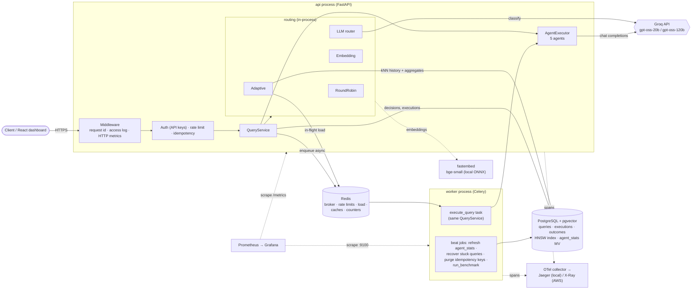
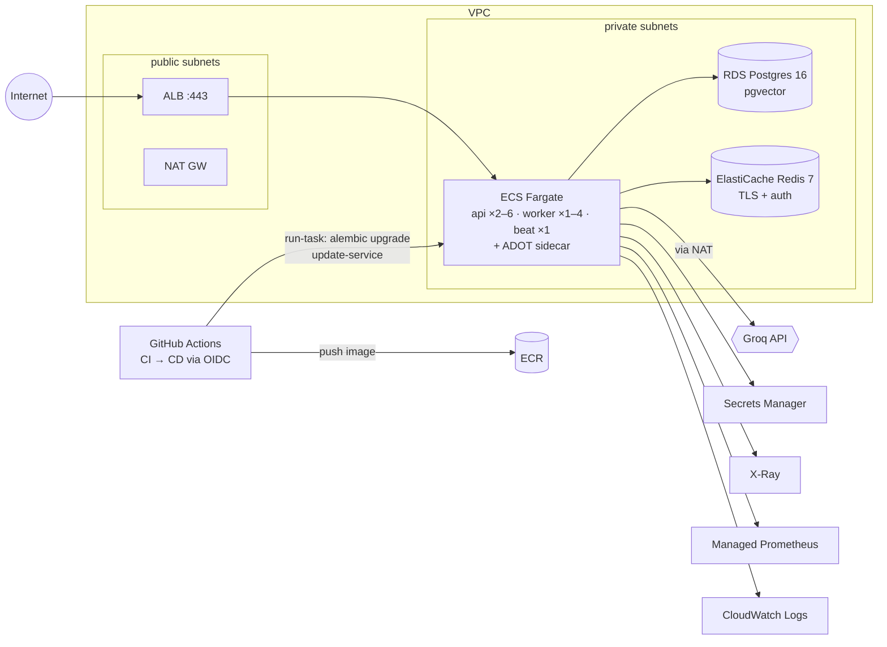

# Architecture

AdaptiveRoute is a **modular monolith with one background worker**. A single Python
package (`adaptiveroute`) is deployed as three processes from one container image,
plus Postgres and Redis:

| Process | Command | Responsibility |
|---|---|---|
| **api** | `uvicorn adaptiveroute.api.app:create_app --factory` | HTTP API, auth, rate limiting, idempotency, routing (in-process), sync execution, dashboard |
| **worker** | `celery -A adaptiveroute.worker.celery_app worker` | async agent execution, benchmark replays |
| **beat** | `celery ... beat` | schedules maintenance jobs (stats refresh, stuck-query recovery, idempotency purge) |
| **PostgreSQL + pgvector** | | queries, decisions, executions, outcome labels (with embeddings), idempotency keys, benchmark runs |
| **Redis** | | Celery broker/results, rate-limit buckets, in-flight load, embedding + response caches, round-robin counter |

The "routing/agent service" is a set of modules inside that package rather than its own
network service. A routing decision takes milliseconds and sits on every request's
critical path, so a network hop would add latency and a failure mode for no benefit.
See [ADR 0001](adr/0001-modular-monolith.md).

## Component diagram



## Request flow (synchronous)

```mermaid
sequenceDiagram
    autonumber
    participant C as Client
    participant A as API (FastAPI)
    participant R as Router
    participant PG as Postgres
    participant RD as Redis
    participant G as Groq

    C->>A: POST /v1/queries (Bearer key, Idempotency-Key)
    A->>PG: verify API key (cached 30 s)
    A->>RD: token bucket (Lua, atomic)
    A->>PG: claim Idempotency-Key (INSERT ... ON CONFLICT DO NOTHING)
    A->>R: route(query)
    R->>R: embed query (local ONNX, ~4 ms; Redis cache)
    R->>PG: per-agent kNN over labelled outcomes (pgvector LATERAL)
    R->>PG: agent_stats (materialised view, cached 5 s)
    R->>RD: in-flight executions per agent
    R-->>A: decision + per-term score breakdown
    A->>PG: INSERT query (status=queued), COMMIT
    A->>PG: claim query (queued → running)
    Note over A,G: no DB connection is held during the LLM call
    A->>G: chat completion (deadline, retries w/ jitter, Retry-After)
    alt selected agent errors / times out
        A->>G: fail over to runner-up agent
    end
    A->>PG: INSERT execution(s), status=completed|failed, COMMIT
    A->>PG: store response under Idempotency-Key
    A-->>C: 200 decision + executions + answer (X-Request-ID, X-RateLimit-*)
    C->>A: POST /v1/queries/{id}/feedback {success}
    A->>PG: upsert outcome label (embedding copied) → future kNN evidence
```

With `mode=async` the API stops after step 9: it enqueues `execute_query(query_id)` on
Celery and returns `202`. The worker runs the same `QueryService.execute`. It first
claims the query atomically, so a redelivered task (the worker uses `acks_late`) can't
execute twice.

## Code layout

```
src/adaptiveroute/
├── domain.py            frozen dataclasses: AgentSpec, RoutingDecision, ExecutionResult, ...
├── ports.py             Protocols: Embedder, PerformanceHistory, LoadTracker, SequenceCounter
├── config.py            pydantic-settings (AR_* env vars)
├── container.py         composition root: builds every dependency once (API + worker)
├── llm/                 OpenAI-compatible client (Groq), retry/deadline policy, pricing
├── agents/              registry (config/agents.yaml) + executor
├── embeddings.py        fastembed, hashing fallback, Redis cache
├── routing/             base, round-robin, embedding, LLM router, adaptive + scoring
├── history/             PerformanceHistory: in-memory (replay/tests) and pgvector
├── state/               load tracker + counters: in-memory and Redis
├── services/            QueryService (route → persist → execute → persist)
├── db/                  SQLAlchemy models, repositories, sessions
├── api/                 FastAPI app, routes, auth, rate limit, idempotency, errors
├── worker/              Celery app, tasks, per-process event loop
├── observability/       structlog, Prometheus metrics, OpenTelemetry
└── evaluation/          dataset, checkers, matrix collection, replay, metrics, report
```

**Dependency direction.** `domain` and `ports` import nothing from the project.
Routing depends only on the ports. Infrastructure (`db`, `state`, `history/postgres`,
`llm`) implements the ports. Only `container.py` knows which implementation backs each
port. That is why the benchmark can replay the **exact production routing code** with
in-memory history, and why the tests need no mocking framework.

## Deployment views

- **Local:** `docker compose up` starts all of the above plus Jaeger, Prometheus and
  Grafana. See [deployment.md](deployment.md).
- **AWS:**
  - ECS Fargate services (api ×2+, worker, beat) behind an ALB;
  - RDS PostgreSQL 16 with pgvector and ElastiCache Redis;
  - secrets in Secrets Manager;
  - an ADOT collector sidecar that sends traces to X-Ray and metrics to Amazon Managed
    Prometheus;
  - images in ECR, deployed by GitHub Actions through OIDC.

  Terraform lives in `deploy/terraform/`.


