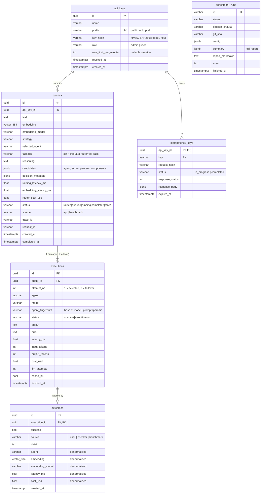

# Database schema

PostgreSQL 16+/17 with the [pgvector](https://github.com/pgvector/pgvector) extension.
The schema is managed by Alembic (`migrations/`), and the ORM models are in
`src/adaptiveroute/db/models.py`. CI runs `alembic upgrade head`, `alembic check`
(models and migrations must not drift), `downgrade base` and `upgrade head` again.



## Tables

| Table | Purpose | Notes |
|---|---|---|
| `api_keys` | API credentials | The plaintext key is never stored. `prefix` is unique so lookup is an index hit. |
| `queries` | One row per routed query: the full decision | Written **before** execution. `candidates` keeps every agent's score and its per-term breakdown, which drives the dashboard and audits. |
| `executions` | One row per agent run | `UNIQUE (query_id, attempt_no)`. `agent_fingerprint` ties results to the exact prompt and model. |
| `outcomes` | Task-success labels: the adaptive router's training signal | One label per execution (`UNIQUE execution_id`, latest wins). Copies agent, embedding, latency and cost from the execution and query (see below). |
| `idempotency_keys` | Stored responses for retries | PK `(api_key_id, key)`; purged hourly after `expires_at`. |
| `benchmark_runs` | Benchmark reports for the API and dashboard | `summary` holds the whole report JSON. |

### Why `outcomes` is denormalised

The hot read on every adaptive routing decision is:

> For each agent, the *k* labelled past queries most similar to this one.

Normalised, that is `outcomes ⋈ executions ⋈ queries` with a vector ORDER BY on
`queries.embedding` and a filter on `executions.agent`. HNSW can't serve that well,
because the filter lives in a different table from the vector. Copying the agent,
embedding, latency and cost into `outcomes` turns it into a single-table search:

```sql
SELECT a.agent, n.similarity, n.success, n.latency_ms, n.cost_usd
FROM unnest(:agents) AS a(agent)
CROSS JOIN LATERAL (
    SELECT 1 - (o.embedding <=> :query) AS similarity,  -- <=> = cosine distance
           o.success, o.latency_ms, o.cost_usd
    FROM outcomes o
    WHERE o.agent = a.agent AND o.embedding_model = :model
    ORDER BY o.embedding <=> :query
    LIMIT :k
) AS n;
```

`LATERAL` runs the inner top-k once per agent. Every agent gets its own *k*
neighbours, so the most-used agent can't crowd out evidence about the others. The
`embedding_model` filter means switching embedding models never mixes vectors from
different spaces. The copied fields are written once, when the label is recorded, and
executions are immutable, so the copies can't go stale.

## Indexes

| Index | Serves |
|---|---|
| `outcomes (embedding vector_cosine_ops)` HNSW, m=16, ef_construction=64 | kNN above |
| `outcomes (agent, embedding_model)` | the per-agent filter |
| `queries (created_at)` | keyset pagination in `GET /v1/queries` |
| `executions (query_id)`, `executions (agent, finished_at)` | joins, stats |
| `idempotency_keys (expires_at)` | purge job |

## Materialised view `agent_stats`

The view holds per-agent stats over the last 30 days: executions, failures, P50/P95
latency, mean and total cost, labelled count, and successes. Latency and mean cost
come from **successful** executions only (migration 0002), because failures often
fail fast and would make an agent look quicker and cheaper than it is when it
actually answers. Cache hits are excluded for the same reason. Celery beat refreshes it every
60 s with `REFRESH MATERIALIZED VIEW CONCURRENTLY`, which is why it has a unique index
on `agent`; readers are never blocked. `GET /v1/agents` and the adaptive router's
agent-level priors read it; the router also caches it per process for 5 s.

## Migration policy

- Migrations are hand-written, reviewed, and reversible (`downgrade` is implemented).
- `alembic check` in CI fails if the ORM models and migrations diverge.
- On AWS, migrations run as a one-off ECS task **before** services are updated, so
  new code never meets an old schema. Breaking changes follow expand → migrate →
  contract across releases.
- `EMBEDDING_DIM = 384` is part of the schema. Changing the embedding model's
  dimension needs a migration and re-embedding, and is guarded by the
  `embedding_model` column.
