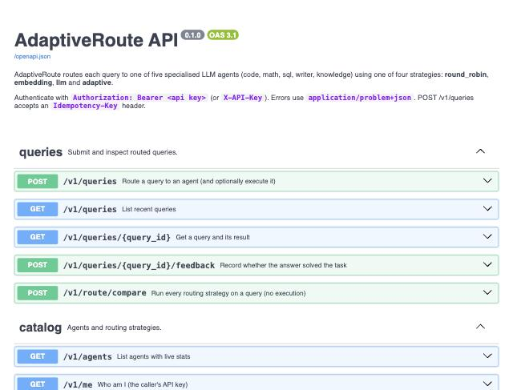

# AWS deployment verification (2026-10-05)

A real end-to-end deployment of the Terraform stack and CD pipeline, run to prove they
work, then torn down to stop billing. Region `us-east-1`. Demo sizing from
`deploy/terraform/terraform.tfvars`:
- `environment = "dev"`;
- 1 api, 1 worker and 1 beat task;
- `db.t3.micro`;
- `cache.t4g.micro`;
- Container Insights off.

## What was run

1. **`terraform apply`** created 81 resources: VPC/NAT, ALB, ECS Fargate, RDS
   PostgreSQL 16, ElastiCache Redis 7 (TLS + auth), ECR, Secrets Manager, Amazon
   Managed Prometheus, and the GitHub OIDC provider plus deploy role.
2. **The Groq key** was stored with `aws secretsmanager put-secret-value`. It is
   never in Terraform state.
3. **GitHub repository variables** were set from `terraform output github_variables`.
4. **The Deploy workflow** ran via `workflow_dispatch`:
   [run 37362416799](https://github.com/Akshar106/adaptiveroute/actions/runs/37362416799).
   It passed OIDC login, the image build and push to ECR, `alembic upgrade head` as a
   one-off Fargate task, the rollout of the api, worker and beat services, and the
   `/readyz` smoke test.
5. **An admin API key** was created with a one-off ECS task
   (`adaptiveroute create-api-key`). Its CloudWatch log stream was deleted right
   after the key was read.

## Problems found on the way (and fixed in the repo)

| Problem | Cause | Fix |
|---|---|---|
| `FreeTierRestrictionError` creating RDS | AWS Free-plan accounts cap backup retention; ours was 7 days | `db_backup_retention_days` variable (default 7, demo 1) |
| `InsufficientDBInstanceCapacity` for `db.t4g.micro` | not orderable for PostgreSQL 16 in this account/region (`describe-orderable-db-instance-options`) | demo uses `db.t3.micro` (already a variable) |
| Deploy: `Not authorized to perform sts:AssumeRoleWithWebIdentity` | the repository uses GitHub's *immutable* OIDC subject (`repo:OWNER@id/REPO@id:...`), but the trust policy expected `repo:OWNER/REPO:...` | `github_oidc_sub_prefix` variable pins the exact subject, including the numeric IDs |
| Deploy job queued for ~10 min | GitHub Actions was reporting degraded performance | none needed (external) |

## Live checks

```text
GET /healthz  -> 200 {"status":"ok"}   (79 ms from a laptop in the US)
GET /readyz   -> 200 {"status":"ready","checks":{"postgres":"ok","redis":"ok","embedder":"ok"},
                      "llm_configured":true,"strategies":["round_robin","embedding","llm","adaptive"]}
GET /         -> 200 (dashboard)        GET /docs -> 200 (Swagger UI)
```

A real query through the deployed system (adaptive strategy, synchronous):

| | |
|---|---|
| Query | "Write a SQL query that returns the top 5 customers by total revenue in 2024." |
| HTTP | 200 in 0.85 s end to end (client-side) |
| Decision | `sql` agent; routing 120 ms (first request on a fresh task) |
| Execution | `openai/gpt-oss-20b`, 508 ms, 380 input / 350 output tokens, estimated $0.000133 |
| Answer | a correct SQLite query: joins customers → orders → order_items, excludes cancelled orders, filters 2024, groups and orders by revenue, LIMIT 5 |

Observability on AWS:
- **Traces:** AWS X-Ray received 13 traces from about 55 requests, as expected with 10%
  head sampling plus parent-based sampling.
- **Metrics:** Amazon Managed Prometheus, queried with SigV4, showed:
  - `up` = 1 for both `adaptiveroute-api` and `adaptiveroute-worker`;
  - `ar_routing_decisions_total` by strategy (adaptive 6, embedding 5, round_robin 5);
  - `ar_agent_executions_total{agent="sql",status="success"}` = 1;
  - `ar_cost_usd_total` = 0.0001335.
- **Logs:** JSON logs from every service in CloudWatch Logs.




## Teardown

`terraform destroy` with the same tfvars. In a `dev` environment it removes:
- the database, without a final snapshot;
- the secrets, deleted immediately;
- ECR, including its images.

The GitHub repository variables are deleted too, so CI on `main` stops triggering
deploys. The S3 state bucket is kept; it costs fractions of a cent.
